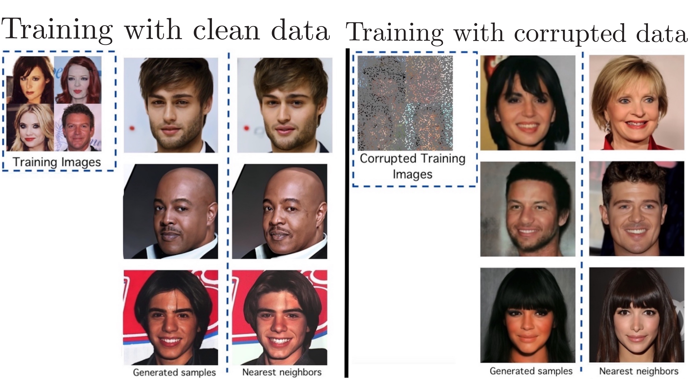

> We present the first diffusion-based framework that can learn an unknown distribution using only highly-corrupted samples. This problem arises in scientific applications where access to uncorrupted samples is impossible or expensive to acquire. Another benefit of our approach is the ability to train generative models that do not memorize any individual training sample, since they never observe clean training data. Our main idea is to introduce additional measurement distortion during the diffusion process and require the model to predict the original corrupted image from the further corrupted image. We prove that our method leads to models that learn the conditional expectation of the full uncorrupted image given this additional measurement corruption. This holds for any corruption process that satisfies some technical conditions (and in particular includes inpainting and compressed sensing). We train models on standard benchmarks (CelebA, CIFAR-10 and AFHQ) and show that we can learn the distribution even when all the training samples have 90% of their pixels missing. We also show that when we finetune foundation models using small corrupted datasets (e.g. MRI scans with block corruptions), we learn the clean distribution without memorizing the training set.

Please read the [paper](https://arxiv.org/abs/2305.19256) for more details.